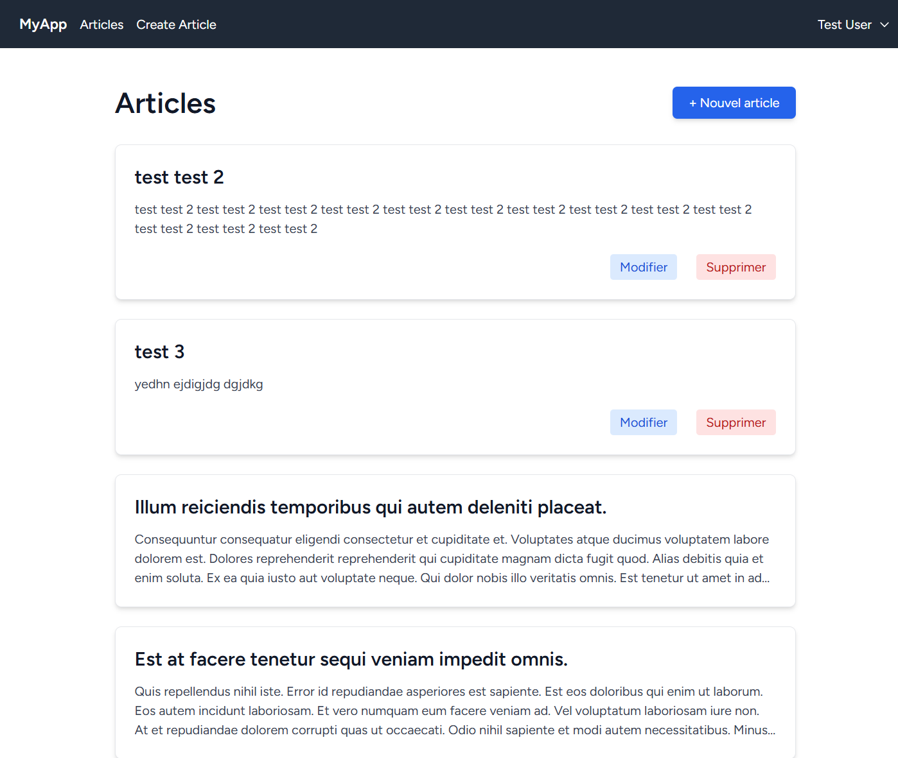
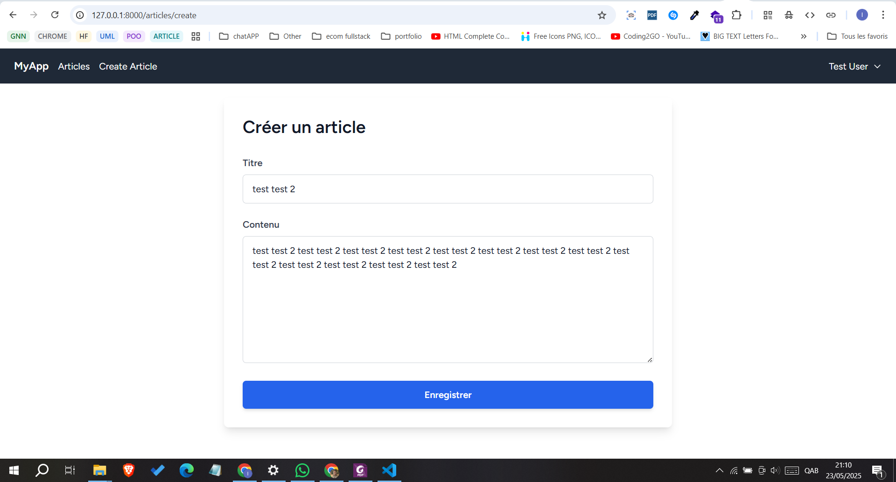
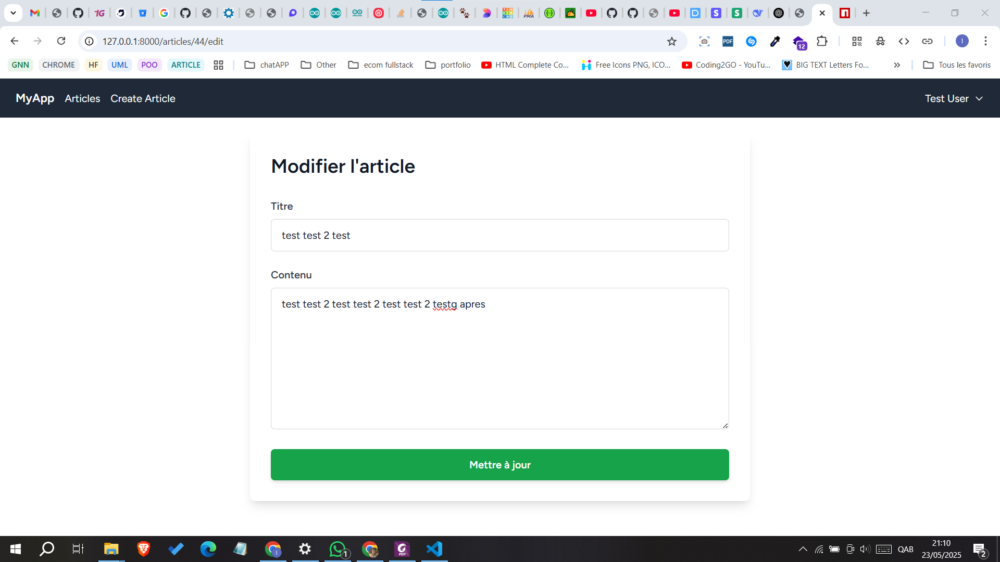

# 🚀 Tutoriel : Création d'une Application de Blog avec Laravel et React

Bienvenue dans ce tutoriel complet pour créer une application de blog moderne utilisant **Laravel** en backend et **React** en frontend.

---

## 👨‍💻 Réalisé par

Ce projet a été réalisé par : **Abdelmounim MOOUADILI**,
dans le cadre du Master _MST-RSI_.

---

## 🧰 Prérequis

Assure-toi d'avoir les outils suivants installés sur ta machine :

-   PHP 8.2 ou plus
-   Composer 2+
-   Node.js 16+
-   MySQL 5.7+

---

## 🛠️ Étapes d'installation

### 1. Cloner le projet

```bash
git clone https://github.com/momonaim01/mst-rsi-web-blog-app.git
cd mst-rsi-web-blog-app
```

### 2. Installer les dépendances PHP

```bash
composer install
```

### 3. Installer les dépendances JavaScript

```bash
npm install
```

### 4. Configurer l'environnement

modifier le `.env`

### 5. Configurer la base de données

Dans le fichier `.env`, adapte les valeurs suivantes :

```env
DB_CONNECTION=mysql
DB_HOST=127.0.0.1
DB_PORT=3306
DB_DATABASE=blog_app
DB_USERNAME=root
DB_PASSWORD=
```

### 6. Lancer les migrations et les seeders

```bash
php artisan migrate --seed
```

### 7. Compiler les assets

```bash
npm run dev
```

### 8. Démarrer les serveurs

```bash
php artisan serve      # Laravel
npm run dev            # Vite (React)
```

---

## ✨ Fonctionnalités de l'application

### 🔐 Authentification

-   Inscription, connexion, déconnexion
-   Réinitialisation du mot de passe
-   Routes protégées

### 📝 Gestion des articles

-   CRUD complet (créer, lire, modifier, supprimer)
-   Éditeur de texte riche
-   Catégorisation des articles

### 💡 UI Moderne

-   Design responsive (mobile + desktop)
-   Interface propre et intuitive
-   Mode sombre intégré

---

## 🧱 Structure du projet

```
blog-app/
├── app/                  # Backend Laravel
├── resources/
│   └── js/
│       ├── Components/   # Composants React réutilisables
│       ├── Layouts/      # Layouts globaux
│       └── Pages/        # Pages avec Inertia.js
├── routes/               # Routes Laravel
├── public/               # Fichiers accessibles publiquement
├── database/             # Migrations & seeders
└── tests/                # Tests PHP
```

---

## ⚙️ Développement

### Créer un modèle Laravel (Article)

```bash
php artisan make:model Article -m
```

### Configuration serveur

Configurer Nginx ou Apache pour pointer vers le dossier `public`.

---

## 📸 Captures d’écran

Les captures dans le dossier `screenshots/` :

-   
-   
-   

---

## 🧹 Nettoyage du projet (Windows)

Avant de redémarrer proprement ton projet Laravel + Inertia.js sous Windows, voici les étapes recommandées :

### 🧼 1. Supprimer les dépendances

#### Supprimer `node_modules`, `vendor`, et les fichiers de lock :

Due to its folder nesting Windows can’t delete the folder as its name is too long. To solve this, install RimRaf:

```bash
npm install rimraf -g

rimraf node_modules
rimraf vendor
# or
rmdir /s /q node_modules
rmdir /s /q vendor

del package-lock.json
del composer.lock
```

> ⚠️ Attention : Ces commandes suppriment définitivement les dossiers et fichiers.

---

### 📦 2. Réinstaller les dépendances

```bash
npm install
composer install
```

---

### 🔄 3. Réinitialiser la base de données

```bash
php artisan migrate:fresh --seed
```

---

### ⚙️ 4. Nettoyer les caches Laravel

```bash
php artisan optimize:clear
```

---

### 🛠 5. Recompiler les assets

```bash
npm run dev
```

---
